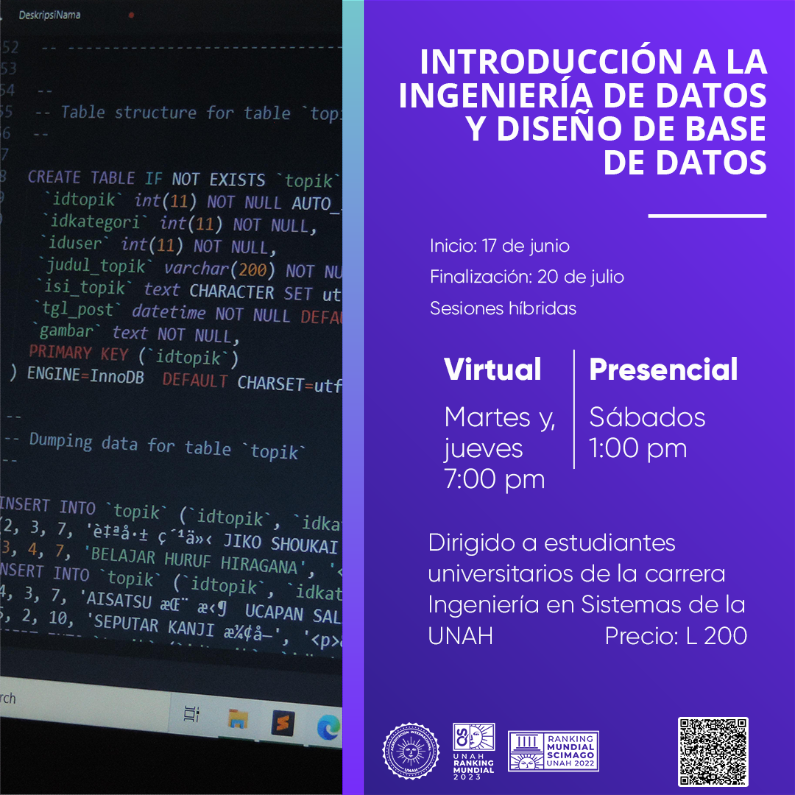

# Introducción a la Ingeniería de Datos y Diseño de Base de Datos
Repositorio para el curso de Introducción a Ingeniería  de Datos y Diseño de Base de datos con Python, MySQL y Talend, UNAH 2023

## Descripción y temas del curso
[Calendarización, temas y fechas](https://cutt.ly/qwwQ24Df)  
[Formulario de inscripción](https://cutt.ly/FwwI7Jrf)

## Objetivos
### Generales
- Introducción de conceptos fundamentales del diseño de base de datos.
- Introducción a las herramientas de un ingeniero de datos. 
- Técnicas de normalización.
- Desarrollo de análisis crítico ante diferentes escenarios.
- Manejar consultas.
- Desarrollo de soft skills (human science) por medio de ejercicios grupales.

### Específicos
- Modelar bases de datos relacionales a partir de casos de estudio utilizando metodologías de diseño, utilizando el modelo Entidad Relación como un modelo conceptual de interpretación y abstracción, como un primer acercamiento al lenguaje de consultas.
- Reconocimiento de patrones en cadenas de texto.
- Capacidad para trasladar un modelo Entidad-relación a un modelo relacional.
- Conocimiento de diferentes cláusulas y sentencias SQL.
- Precisión y eficiencia al realizar consultas en una base de datos relacional a través de consultas legibles, eficientes y estructuradas.
- Poblar una base de datos a través de diferentes fuentes de datos (archivos planos, bases de datos, API) gracias a las bondades de un ETL.
- Capacidad para conectarse y hacer consultas a una base de datos relacional desde un lenguaje de programación de alto nivel.

## Requisitos para este curso

|              | **Académicos**                                                                    | **Técnicos**                                                                                                                                                  | **Software**                                                                                                                                                 |
|--------------|-----------------------------------------------------------------------------------|---------------------------------------------------------------------------------------------------------------------------------------------------------------|--------------------------------------------------------------------------------------------------------------------------------------------------------------|
| **Esperado** | 1. Sistemas operativos I (IS-412) 2. Programación orientada a objetos (IS-410) | 1. Python intermedio   a. Paradigma funcional   b. Sentencias de control   c. Try and except 2. Conocimientos básicos de lenguaje SQL   a. DML | 1. OS: Windows 11 Education 2. RAM: 16 GB 3. CPU: 8 cores/16 hilos 4. TPM: versión 2.0 5. Almacenamiento: 30 GB de espacio disponible         |
| **Deseado**  | 1. Programación II (IS-210)                                                       | 1. Experiencia programando en algún lenguaje de programación de alto nivel (Java, Python, Javascript, C++)                                                    | 1. OS: Windows 10 Home version 2004 2. RAM: 8 GB 3. CPU: 4 cores/8 hilos 4. TPM: versión 2.0 5. Almacenamiento: 10 GB de espacio disponible   |